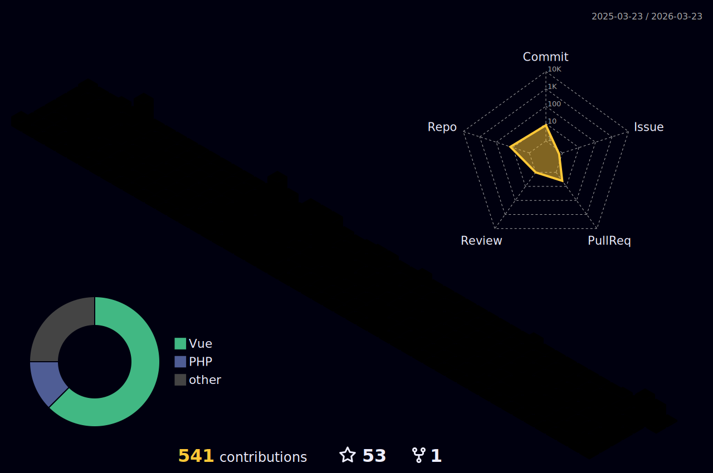

<h1 align="center"></h1>

 

Hello there! Welcome to my GitHub profile. I'm thrilled to have you here. Let me take a moment to introduce myself and give you an overview of what you can find in this repository.

## About Me 👩‍💻

I am passionate about technology and love to explore various domains of software development. My journey in the world of programming started several years ago, and since then, I have been on an exciting learning adventure. My primary focus is on **Software Dev** and **Web apps dev**, and I'm always eager to expand my knowledge and skills in these fields.

## Projects Overview 🚀

I am just starting out on concrete projects. Be on the watch, something great is on build ✔️.

## Tech Stack 💻

Here are some of the technologies I enjoy working with:

  &nbsp;
  &nbsp;
  &nbsp;
  &nbsp;
  &nbsp;
  &nbsp;
  
  
  
  
  

This list is not exhaustive, and I'm always eager to learn new technologies and explore innovative solutions.

## Contact Me 📬

I'm always excited to connect with fellow developers and technology enthusiasts. You can reach me through the channels on my profile :accessibility:.

Feel free to reach out if you have any questions, ideas, or just want to have a friendly conversation.

## Contributions and Collaborations 🤝

I believe in the power of collaboration and open-source communities. If you find any of my projects interesting and would like to contribute or collaborate, please feel free to submit pull requests or get in touch. I value and appreciate all kinds of contributions, big or small.

Thank you for visiting my GitHub profile! Enjoy exploring and have a fantastic day! 🌟

---

<strong>Stay hungry, Stay foolish.   &copy;Frank Dex Devs&reg; 2022<strong>

