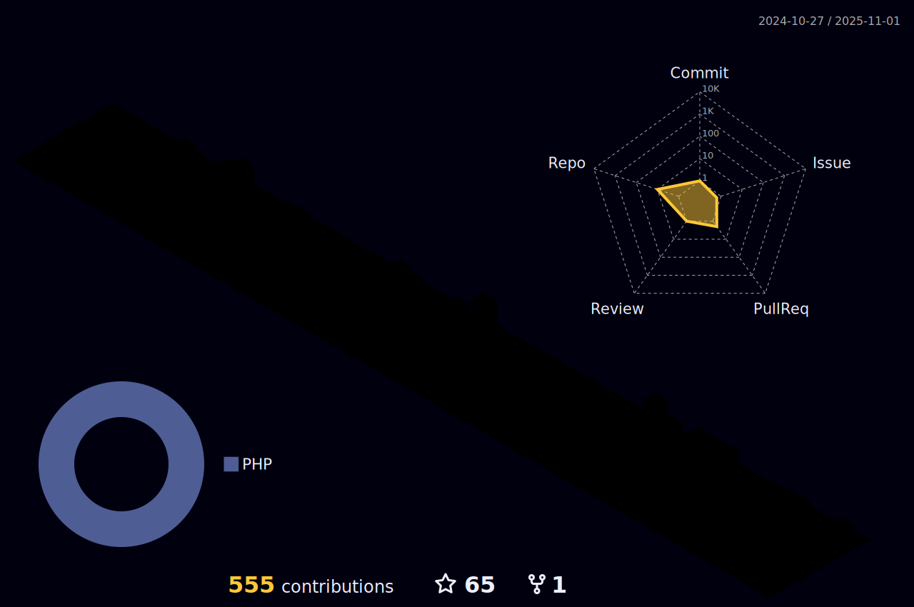

Hello there! Welcome to my GitHub profile. I'm thrilled to have you here. Let me take a moment to introduce myself and give you an overview of what you can find in this repository.

## About Me 👩‍💻

I am passionate about technology and love to explore various domains of software development. My journey in the world of programming started several years ago, and since then, I have been on an exciting learning adventure. My primary focus is on **Software Dev** and **Web apps dev**, and I'm always eager to expand my knowledge and skills in these fields.

## Projects Overview 🚀

👋 Hey there. Some good news from me fellow developers and JavaScript enthusiasts!

Here goes a passionate software developer with a love for creating comprehensive and user-friendly documentation. My primary focus is on building a fantastic JavaScript documentation project that caters to both beginners and experts. 📚

🌟 Explore the JavaScript Docs Project: [Javascript docs for all 😀](https://lucasfrankinc.github.io/javascript-by-francis.github.io/) 

📖 What's Inside?

The JavaScript Docs Project is a comprehensive collection of well-organized documentation, covering various aspects of JavaScript programming. From the fundamentals to advanced topics, you'll find everything you need to level up your JavaScript skills. 💡

✨ Features:

- Beginner-friendly explanations and examples
- In-depth coverage of JavaScript statements, objects, arrays, and functions... Wait a minute, so much more....
- Clear and concise code snippets to illustrate concepts
- Useful tips and best practices for efficient JavaScript development

I just can't stop building 🚧👷‍♂️. Come back for more ⏲️.

## Tech Stack 💻

Here are some of the technologies I enjoy working with:

  &nbsp;
  &nbsp;
  &nbsp;
  &nbsp;
  &nbsp;
  &nbsp;
  &nbsp;
  &nbsp;
  
  
  
  
  

This list is not exhaustive, and I'm always eager to learn new technologies and explore innovative solutions.

📚 Stay Updated!

Make sure to follow me on GitHub to stay updated with the latest additions and improvements to the JavaScript Docs Project. Feel free to explore my other repositories and projects too. Let's learn, code, and grow together!

Thank you for visiting my GitHub profile. Happy coding, and remember to embrace the beauty of JavaScript! 💻✨

## Contact Me 📬

I'm always excited to connect with fellow developers and technology enthusiasts. You can reach me through the channels on my profile :accessibility:.

Feel free to reach out if you have any questions, ideas, or just want to have a friendly conversation.

## Contributions and Collaborations 🤝

I believe in the power of collaboration and open-source communities. If you find any of my projects interesting and would like to contribute or collaborate, please feel free to submit pull requests or get in touch. I value and appreciate all kinds of contributions, big or small.

✨ Join the Community!

I believe in the power of open-source collaboration and learning together. Your contributions to the JavaScript Docs Project are highly encouraged and welcomed. Let's make learning JavaScript a fun and enriching experience for everyone! 🤝

⭐️ Star, Share, and Spread the Word!

If you find the JavaScript Docs Project valuable and helpful, show your support by giving it a ⭐️ on GitHub. Don't forget to share it with your fellow developers and JavaScript enthusiasts. Together, we can empower the community and make JavaScript programming accessible to all! 🌟

Thank you for visiting my GitHub profile! Enjoy exploring and have a fantastic day! 🌟

---

<strong>Stay hungry, Stay foolish.   &copy;Frank Dex Devs&reg; 2016-2023<strong>

